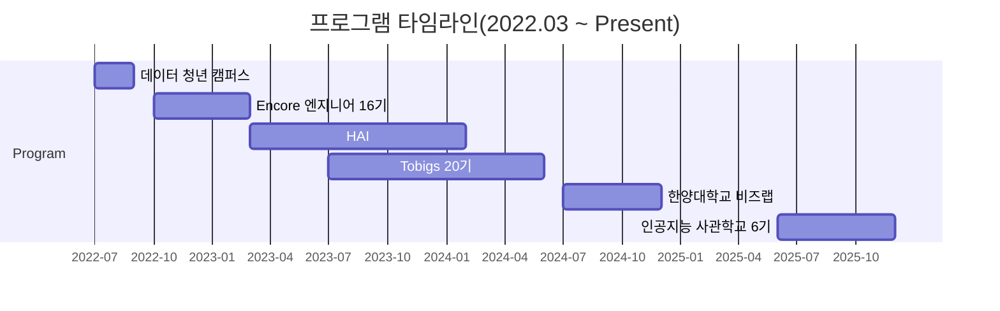

# 👋 Hi, I'm HyeongJun Do

### Interested in AI development,   with a focus on LLMs and diffusion models

> *모델을 단순히 사용하는 것에 그치지 않고,*  
> *AI에 대한 이해를 바탕으로 데이터·시스템·문제 맥락에 맞게 활용합니다.*

 

## 1. Education & Program

### Education
> 한양대학교(서울) 다중전공

- 빅데이터학과 (공학사) `2022.03 ~ 2025.02`
- 경영학과 (경영학사) `2019.03 ~ 2025.02`

### Program

| Period | Program | Organization |
|--------|---------|--------------|
| `2025.06 ~ 2025.12` | **[인공지능 사관학교 6기](https://gj-aischool.or.kr/)** |     |
| `2024.07 ~ 2024.12` | **[비즈랩(빅데이터랩)]([https://github.com/tobigs-datamarket](https://biz.hanyang.ac.kr/en/bizlab))** | 한양대학교 |
| `2023.07 ~ 2024.06` | **[투빅스](https://github.com/tobigs-datamarket)** | 연합 인공지능 동아리 |
| `2023.03 ~ 2024.02` | **[HAI](https://github.com/HanyangTechAI)** | 교내 인공지능 동아리 |
| `2022.10 ~ 2023.03` | **[Encore 빅데이터 엔지니어 16기](https://playdata.io/)** | Playdata |
| `2022.07 ~ 2022.09` | **[데이터 청년 캠퍼스](http://www.bigleader.net/projects)** | 한국데이터산업진흥원 |

## 2. Qualifications

### Awards

| Year | Award | Link |
|------|-------|------|
| `2025` | 인공지능 사관학교 6기 온라인 해커톤 **대상(1위)** | [🏆](https://drive.google.com/file/d/1Xp6P4loUhJ85T2C46xoiXY4gmyYDXCTc/view?usp=sharing) |
| `2023` | 교내 한국어 지역 방언 분류 대회 **3위** | [🏆](https://www.kaggle.com/competitions/hai2023summer/overview) |
| `2022` | 한국관광공사 **사장상** _(관광부상지역 모니터링 시스템 개발)_ | [🏆](https://drive.google.com/file/d/11FliXJrwMraneUoEo8bw_5rGx5OJ4KMq/view?usp=sharing) |
| `2022` | 한국관광 데이터랩 우수 활용사례 공모전 **우수상(2등)** | [🏆](https://drive.google.com/file/d/1xH-kmTamXGiSPQSZD9QWAlBICoycC2xv/view?usp=sharing) |

### Certifications

| Category | Certifications | Link |
|----------|---------------|------|
| **AWS** | Machine Learning – Associate, Specialty Solutions Architect – Associate AI, Cloud – Practitioner | [🪪](https://www.credly.com/users/hyeongjun-do) |
| **Data** | ADsP | [🪪](https://drive.google.com/file/d/157vgaQ_kUevgaTGQxBoku7fSOJox9f2O/view?usp=sharing) |
| **Database** | SQLD | [🪪](https://drive.google.com/file/d/1_qy0zz34BNcD8nySZ16YgqMOXboNRVP4/view?usp=sharing) |

## 3. Tech Stack

> **Main**: 다수 프로젝트에서 주력으로 사용  
> **Experience**: 일부 프로젝트 또는 학습을 통해 사용 경험 보유

| Category | Stack |
|--------|------|
| **Languages** |    |
| **Backend (Main)** |    |
| **Backend**(Experience) |   |
| **Data / ML (Main)** |      |
| **Data Engineering**(Experience) |     |
| **Database** |    |
| **Frontend**(Experience) |        |
| **DevOps / Cloud** |    |
| **OS / Tools** |   |

